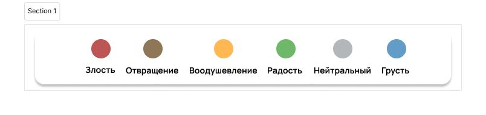

# Эмоции.Текст

Благодаря нашей программе пользователь может транскрибировать аудио/видео с возможностью просмотра эмоционального окраса текста.

Кратко работу программы можно представить так:
загрузка файла -> преобразование в текст -> разбитие текста на кусочки -> анализ аудио-кусочков через нейросеть -> окрашивание кусочков текста в цвет соответствующий эмоции

## Как использовать?
### Установка
1. Зайдите в командную строку.
2. Перейдите в папку, в которой будут хранится файлы, необходимые для работы программы.
3. Введите команду: 
    ```bash
    git clone https://github.com/ArMaGeDoN9112/python_project.git
    ```
4. Активируйте виртуальное окружение. Введите следующие команды в командную строку в соответствующем порядке:
   - Unix-системы (Mac, Linux):
   ```bash
   source venv/bin/activate
   ```
   - Windows:
    ```bash
   .\venv\Scripts\activate
   ```
5. Установите все необходимые зависимости
    ```bash
   pip install −r requirements.txt
   ```

### Использование

Для того, чтобы запустить приложение и эксплуатировать его, последовательно выпол- няйте следующие действия:
1. Откройте командную строку и перейдите в папку с файлами программы
2. Наберите в командной строке: "python app.py"и нажмите "Enter"
3. Зайдите в браузер и перейдите по адресу: http://127.0.0.1:8000
4. Загрузите файл и выберите нужные опции (эмоциональный окрас, эмоциональная статистика)
5. Нажмите кнопку «Генерировать»
6. Ожидайте в течение ∼ 1 мин.
7. На экране начнет появляться текст

## Кратко про все файлы:

`analyze.py` - обработка входящего аудиопотока и преобразование его в отрезки из пяти слов с помощью библиотеки `vosk`. На каждый отрезок известно время начала произношения первого слова и конец последнего(пятого). Отрезки отправляются на сервер. А данные о начале и конца отрезка отправляются на обрезку в другую функцию.

`app.py` - "сервер" нашей программы. Здесь происходит обработка всех запросов.

С помощью определенных запросов можно: загрузить файл, начать анализ аудио/видео, зарендерить html страничку.

`encoder.pkl` и `scaler.pkl` - эти файлы содержат информацию о соотвествующих определенных python-объектах.

`fer.py` - скрипт с нейросетью, которая обрабатывает видео и показывает эмоции человека на данном видео.

Подробнее: на вход поступает видео, которое пользователь загрузил на сайте, далее видео обрабатывает нейросеть, которая поверх исходного видео накладывает прямоугольник вокруг лица, распознаваемого человека.

`haarcascade_frontalface_default.xml` - содержит информацию о конфигурации нейросети для распознавания лиц.

`model.keras` и `model.h5` - обученные модели с помощью машинного обучения.

`requirements.txt` - необходимые зависимости для работы программы.

`/templates/` - директория, в которой содержаться html-файлы.

`/static/` - директория, в которой содержатся файлы, необходимые для корректного отображения сайта.

`/audio/` - директория, в которую попадают временные файлы (отрезки аудио), который сразу же после обработки удаляются.


